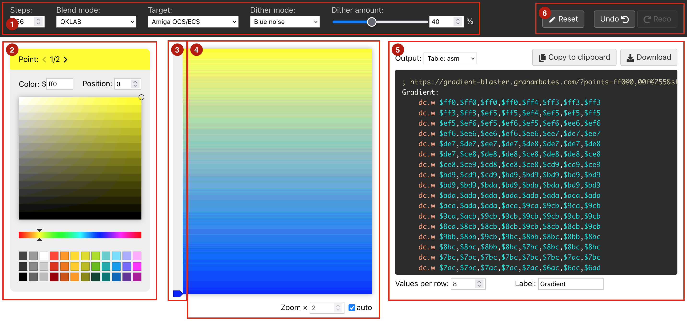

# Gradient Blaster

https://gradient-blaster.grahambates.com

Gradient Blaster is a web-based tool to build gradient data for retro platforms using a visual editor. It supports multiple algorithms for colour blending and dithering. The gradient data can be exported in several formats for use with different languages and use cases.

## Interface

1. [Options](#options)
2. Selected point detail - Editor for the current point
3. Points track - Draggable/selectable markers of the points defined on the gradient
4. Preview
5. [Output](#output) - Export gradient data in desired format
6. History - undo/redo changes or reset to default state

---

## Options

### Steps:

The number of values in the gradient output i.e. the number of pixels it spans.

### Blend mode:

The colour model / algorithm used to interpolate between points in the gradient.

1. **OKLAB:** Interpolates values using the [OKLAB](https://bottosson.github.io/posts/oklab/) colour space. This is a perceptual colour space designed for image processing tasks, including creating smooth and uniform looking transitions between colors. 
2. **LAB:** Interpolates values using the standard [LAB](https://en.wikipedia.org/wiki/CIELAB_color_space) colour space.
3. **Gamma adjusted RGB:** Converts to linear colour space using the SRGB model prior to interpolation. Applies adjustments for percieved brightness. Based on ['Mark's method'](https://stackoverflow.com/questions/22607043/color-gradient-algorithm).
4. **Simple RGB:** Naive linear interpolation of the raw RGB values.

### Target:

The platform and colour mode that the gradient is intended for:

| Platform | Bit depth | Data format |
|-|-|-|
| [Amiga OCS](https://en.wikipedia.org/wiki/Original_Chip_Set)/[ECS](https://en.wikipedia.org/wiki/Amiga_Enhanced_Chip_Set) | 12 bit (4 per channel) | Single word: `R3 R2 R1 R0 G3 G2 G1 G0 B3 B2 B1 B0`
| [Amiga OCS](https://en.wikipedia.org/wiki/Original_Chip_Set)/[ECS](https://en.wikipedia.org/wiki/Amiga_Enhanced_Chip_Set)   Interlaced | 15 bit (effective) | As above, but two alternating frames to give the appearence of blended colours and provide an extra 'fake' bit per channel
| [Amiga AGA](https://en.wikipedia.org/wiki/Amiga_Advanced_Graphics_Architecture) | 24 bit (8 per channel) | Two words: high/low nibbles  A: `R7 R6 R5 R4 G7 G6 G5 G4 B7 B6 B5 B4`  B: `R3 R2 R1 R0 G3 G2 G1 G0 B3 B2 B1 B0`
| [Atari ST](https://en.wikipedia.org/wiki/Atari_ST) | 9 bit (3 per channel) |  Single word: `__ R2 R1 R0 __ G2 G1 G0 __ B2 B1 B0`
| [Atari STe](https://en.wikipedia.org/wiki/Atari_ST#STE_models)/[TT](https://en.wikipedia.org/wiki/Atari_TT030) | 12 bit (4 per channel) | Single word: LSB first `R0 R3 R2 R1 G0 G3 G2 G1 B0 B3 B2 B1` |
| [Atari Falcon](https://en.wikipedia.org/wiki/Atari_Falcon) | 18 bit (6 per channel) | Single longword: 2 LSB per byte unused, 3rd byte blank `R5 R4 R3 R2 R1 R0 __ __ G5 G4 G3 G2 G1 G0 __ __` `__ __ __ __ __ __ __ __ B5 B4 B3 B2 B1 B0 __ __` |
| [Atari Falcon](https://en.wikipedia.org/wiki/Atari_Falcon)  true colour | 16 bit (5 red, 6 green, 5 blue) | Single word: `R4 R3 R2 R1 R0 G5 G4 G3 G2 G1 G0 B4 B3 B2 B1 B0` |

### Dither Modes:

1. **Off:** no dithering, just hard quantise to the desired bit depth.
2. **Shuffle:** Switches pairs of values at colour boundaries to lessen the appearance of banding.
3. **Error diffusion:** Applies [one-dimesionsal error diffusion](https://en.wikipedia.org/wiki/Error_diffusion#One-dimensional_error_diffusion) to values.
4. **Blue noise:** Adds [blue noise](https://en.wikipedia.org/wiki/Colors_of_noise#Blue_noise) to data to each channel before quantising.
5. **Blue noise mono:** As above, but applies the same noise values across all RGB channels, whereas normally we use a different starting offset for each channel. Less subtle but avoids colour variation in the dithering artifacts.
6. **Golden ratio:** Adds noise using an [algorithm based on the Golden ratio sequence](https://bartwronski.com/2016/10/30/dithering-part-two-golden-ratio-sequence-blue-noise-and-highpass-and-remap/). Similar to blue noise, this givens an even distribution of noise. Depending on the data either one of these may give better results.
7. **Golden ratio mono:** *See Blue noise mono*
8. **White noise:** Applies completely random noise. Generally looks pretty bad, but useful for comparison with other noise algorithms or to create a deliberately noise appearance.
9. **White noise mono:** *See Blue noise mono*
10. **Ordered:** Applies +/- offset to odd and even rows. This gives a consistent alternating pattern.
11. **Ordered mono:** Applies the same offset to all channels, whereas normally the green channel is flipped +/- for a smoother appearance.

### Dither amount:

Multiplier for noise or adjustments applied by the current dithering algorithm.

### Shuffle count:

Maximum numer of pairs to swap at each boundary when using the Shuffle dither mode.

---

## Editing

The gradient is defined by a list of fixed points which have a colour value and position. These are then interpolated to provide the intermediate values.

The left hand panel (2) shows the currently selected point and allows you to edit the colour and position. The center panel shows a preview of the gradient (4) and has markers for the points in the track down the left hand side (3).

### Adding a point:
Click in the track (3) to add a new point at that position

### Selecting a point:
- Click the marker in the track (3)
- Navigate using the arrows at the top of the detail panel (2)

### Moving a point:

To change to the position of a point you can either:
- Drag the marker in the track (3)
- Select the point and edit the 'Position' field (2)

### Removing a point:

To remove a point for the gradient can either:
- Select the point and click the 'Remove' button in the detail panel (2)
- Drag the point outside of the track (3)

--- 

## Output

The gradient can be exported in the following formats:

### Copper list:

For Amiga targets, outputs data for the [Copper](https://en.wikipedia.org/wiki/Original_Chip_Set#Copper) to output the vertical gradient based on line wait commands.

### Table:

Outputs the raw colour values for each step in the gradient. Supports code generation for several languages, as well as binary download in [Big Endian](https://en.wikipedia.org/wiki/Endianness) suitable for `INCBIN` into your code.

### PNG Image:

Download a PNG of the gradient preview. This contains the vertical gradient as shown in the preview, but at native resolution and allows you to specify the width. This can then be shared with designers/graphicians.

---

## Links

- [Leave a comment on Pouet](https://www.pouet.net/prod.php?which=92033)
- [Discussion on English Amiga Board](https://eab.abime.net/showthread.php?p=1559925)

## References

- https://bartwronski.com/2016/10/30/dithering-part-two-golden-ratio-sequence-blue-noise-and-highpass-and-remap/
- https://bottosson.github.io/posts/oklab/
- https://stackoverflow.com/questions/22607043/color-gradient-algorithm

## Thanks to…

- Soundy/Deadliners: for creating the original [Gradient Master](http://deadliners.net/gradientmaster/index.html) that provided inspiration for this tool
- Evil/DHS: For suggestion and technical support implementing for Atari target modes
- Pink/Abyss: for suggesting the interlace mode